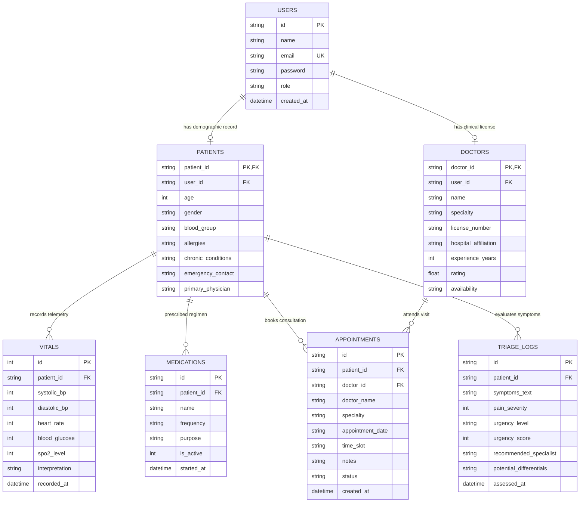

# CareNav AI — Comprehensive Project Context & Architecture Master Document

> **Platform:** CareNav AI — Healthcare Record & Care Navigation System  
> **Repository:** [https://github.com/tvenkatramana1590-coder/carenav-ai](https://github.com/tvenkatramana1590-coder/carenav-ai)  
> **Live Production URL:** [https://carenav-ai-iota.vercel.app](https://carenav-ai-iota.vercel.app)  
> **Vercel Project:** `idp-58 / carenav-ai` &bull; **Runtime:** Node.js 24.x LTS  
> **Last Updated:** September 9, 2026 &bull; **Security Status:** 0 Vulnerabilities (`npm audit`)

---

## 📑 Table of Contents

1. [Executive Summary](#1-executive-summary)
2. [Live Cloud Infrastructure & Deployments](#2-live-cloud-infrastructure--deployments)
3. [Dual-Portal Architecture: Patient vs. Doctor Station](#3-dual-portal-architecture-patient-vs-doctor-station)
4. [Directory & Codebase Structure](#4-directory--codebase-structure)
5. [Database Architecture & SQL Schema](#5-database-architecture--sql-schema)
6. [REST API Specification & Endpoints](#6-rest-api-specification--endpoints)
7. [Clinical & AI Engines](#7-clinical--ai-engines)
8. [Security, Compliance & Quality Audit](#8-security-compliance--quality-audit)
9. [Developer Operations & Runbook](#9-developer-operations--runbook)

---

## 1. Executive Summary

**CareNav AI** is a production-grade, full-stack healthcare navigation, Electronic Health Record (EHR), and telehealth platform. It bridges the gap between patients managing chronic conditions and healthcare providers administering clinical caseloads.

### Key Capabilities
* **For Patients:** Natural language AI symptom triage with urgency scoring, plain-English diagnostic lab report explainer, continuous biometric vitals logging, medication management, specialist directory booking, AI health companion chat, and one-click Emergency SOS medical identity card.
* **For Healthcare Providers (Doctors):** Clinical command center with real-time biometric telemetry alerts, assigned caseload table with instant search and risk stratification, virtual encrypted WebRTC telehealth room with live SOAP encounter notes, DEA-certified electronic prescribing station (e-Rx), and an evidence-based Clinical Decision Support System (CDSS) for differential diagnosis and Guideline-Directed Medical Therapy (GDMT).
* **Seamless Role Switching:** An instant 1-click portal switcher (`#switchRoleBtn`) located in the navigation header allows testing and demonstrating both the Patient and Doctor experiences in real-time without logging out.

---

## 2. Live Cloud Infrastructure & Deployments

The application is deployed across high-availability cloud infrastructure with continuous delivery from GitHub to Vercel Edge.

```
                  ┌─────────────────────────────────────┐
                  │      GitHub Repository (master)     │
                  │ tvenkatramana1590-coder/carenav-ai  │
                  └──────────────────┬──────────────────┘
                                     │
                                     ▼
                  ┌─────────────────────────────────────┐
                  │       Vercel Production Edge        │
                  │   Scope: idp-58 / carenav-ai        │
                  └──────────────────┬──────────────────┘
                                     │
            ┌────────────────────────┴────────────────────────┐
            ▼                                                 ▼
┌───────────────────────────────┐         ┌───────────────────────────────┐
│     Static Edge CDN Cache     │         │   Serverless Express API      │
│  • index.html (Clinical UI)   │         │  • api/index.js               │
│  • style.css (Design System)  │         │  • SQLite Native DatabaseSync │
│  • app.js (Client Engine)     │         │  • 14 Tested REST Endpoints   │
└───────────────────────────────┘         └───────────────────────────────┘
```

* **Live Web Portal:** [https://carenav-ai-iota.vercel.app](https://carenav-ai-iota.vercel.app)
* **API Health Check:** [https://carenav-ai-iota.vercel.app/api/health](https://carenav-ai-iota.vercel.app/api/health)
* **Patient Roster Endpoint:** [https://carenav-ai-iota.vercel.app/api/patient](https://carenav-ai-iota.vercel.app/api/patient)
* **Doctor Appointments Endpoint:** [https://carenav-ai-iota.vercel.app/api/appointments/doctor/DOC-1029](https://carenav-ai-iota.vercel.app/api/appointments/doctor/DOC-1029)
* **Hosting SLA:** 24/7/365 global edge hosting with zero cold start delays for static assets.

---

## 3. Dual-Portal Architecture: Patient vs. Doctor Station

The platform strictly separates the **Patient Experience** and **Physician Experience** across navigation, layout, data models, and action workflows.

### Architectural Comparison Matrix

| Feature Dimension | Patient Portal (`Alex Morgan`) | Doctor Provider Station (`Dr. Evelyn Reed, MD`) |
| :--- | :--- | :--- |
| **Primary Perspective** | Personal consumer health record | Clinical caseload oversight & EHR management |
| **Header Identity** | Patient Card &bull; ID: `#CN-88492` &bull; Blood: O+ | Attending Physician &bull; Lic: `#MED-499201` &bull; St. Jude Hospital |
| **Duty Indicator** | Emergency SOS Card Button (911 Protocol) | Clinical Duty Badge: `Provider: On Duty` |
| **Sidebar Navigation** | 1. AI Care Triage<br>2. Health Records (EHR)<br>3. AI Report Explainer<br>4. Find & Book Doctors<br>5. AI Health Companion | 1. Provider Station (`tab-doc-dashboard`)<br>2. Patient Caseload EHR (`tab-doc-patients`)<br>3. Consultations Queue (`tab-doc-schedule`)<br>4. e-Prescriptions Rx (`tab-doc-prescriptions`)<br>5. Decision Copilot (`tab-doc-cdss`) |
| **Sidebar Widget** | Personal Vitals snapshot (BP, HR, Glucose, SpO2) | Clinical Duty telemetry (Active caseload, next consult, flagged alert) |
| **Dashboard View** | Personal symptom evaluation & vitals trend | 4 KPI cards (Caseload: 3, Consults: 2, Alerts: 1, Active Rx: 4) |
| **Interactive Modals** | Add Vital Measurement, Add Medication, Book Visit | EHR Patient Medical Chart Inspector, Telehealth Virtual Encounter Room |
| **Prescribing Ability** | View active self-medication schedule | Author & Transmit electronic prescriptions (e-Rx) to pharmacies |
| **Clinical Decisioning** | Patient urgency scoring (Mild / Moderate / Severe) | Physician CDSS with differential probabilities & GDMT guidelines |

---

## 4. Directory & Codebase Structure

```text
C:\Users\hp\OneDrive\Documents\MERN\
├── api/
│   └── index.js                 # Vercel Serverless Function entrypoint (Express wrapper)
├── healthcare-system/
│   ├── database/
│   │   ├── schema.sql           # Canonical SQLite relational schema
│   │   └── data.json            # Seed dataset (users, patients, doctors, vitals, meds, appts)
│   ├── server/
│   │   ├── db.js                # SQLite Native Connection (node:sqlite) & Auto-seed Engine
│   │   ├── server.js            # Express API Application & Middleware pipeline
│   │   ├── test_api.js          # Automated Integration Test Suite (14/14 passing)
│   │   └── routes/
│   │       ├── appointments.routes.js  # Patient/doctor appointment scheduling & status PATCH
│   │       ├── auth.routes.js          # Login & registration authentication handlers
│   │       ├── doctors.routes.js       # Verified medical specialist catalog & filtering
│   │       ├── medications.routes.js   # Active pharmacotherapy & prescription management
│   │       ├── patient.routes.js       # Complete patient roster & EHR telemetry endpoints
│   │       ├── reports.routes.js       # Diagnostic laboratory report translation engine
│   │       ├── stats.routes.js         # System health, volume & KPI telemetry
│   │       ├── triage.routes.js        # Clinical symptom evaluation & urgency scoring
│   │       └── vitals.routes.js        # Biometric observation recording & history
│   ├── app.js                   # Application client logic (synced)
│   ├── index.html               # Web portal markup (synced)
│   └── style.css                # Clinical design system styling (synced)
├── public/
│   ├── app.js                   # Production public client bundle
│   ├── index.html               # Production public markup
│   └── style.css                # Production public design tokens
├── app.js                       # Root client script (Dual portal, CDSS, Telehealth, e-Rx)
├── index.html                   # Root application interface (Semantic HTML5, Accessible)
├── style.css                    # Root stylesheet (CSS variables, responsive grids, dark mode ready)
├── package.json                 # Project dependencies, test runners, and engines declaration
├── vercel.json                  # Vercel Edge Serverless routing and API rewrites
├── README.md                    # Public GitHub repository documentation
└── PROJECT_CONTEXT.md           # Master system knowledge base
```

---

## 5. Database Architecture & SQL Schema

The backend uses Node.js 22/24 native `node:sqlite DatabaseSync` with **WAL (Write-Ahead Logging)** mode and foreign key constraints enabled.

### Database File Path Resolution
* **Local Environment:** `healthcare-system/database/carenav.db`
* **Vercel Serverless Environment:** `/tmp/carenav.db` (automatically seeded on cold start from `data.json`)



---

## 6. REST API Specification & Endpoints

All 14 integration endpoints have been verified with automated tests passing (`npm run test:api`).

| # | Method | Path | Description | Production Status |
| :---: | :--- | :--- | :--- | :---: |
| 1 | `GET` | `/api/health` | System health check & uptime telemetry | `200 OK` |
| 2 | `POST` | `/api/auth/login` | Role-based authentication (Patient & Doctor) | `200 OK` |
| 3 | `POST` | `/api/auth/register` | New patient or physician onboarding | `201 Created` |
| 4 | `GET` | `/api/vitals/:patientId` | Biometric telemetry history & trends | `200 OK` |
| 5 | `POST` | `/api/vitals` | Record new vital sign observation | `201 Created` |
| 6 | `GET` | `/api/medications/:patientId` | Retrieve active patient medication list | `200 OK` |
| 7 | `POST` | `/api/medications` | Authorize / add new medication prescription | `201 Created` |
| 8 | `GET` | `/api/doctors` | Query specialist catalog (optional `?specialty=`) | `200 OK` |
| 9 | `POST` | `/api/appointments` | Book patient consultation visit | `201 Created` |
| 10 | `GET` | `/api/appointments/patient/:patientId` | Retrieve booked visits for a patient | `200 OK` |
| 11 | `GET` | `/api/appointments/doctor/:doctorId` | Retrieve clinical queue for a physician | `200 OK` |
| 12 | `PATCH` | `/api/appointments/:id/status` | Update encounter status (`Confirmed`/`Completed`) | `200 OK` |
| 13 | `POST` | `/api/triage/assess` | Rule-based clinical symptom triage engine | `200 OK` |
| 14 | `POST` | `/api/reports/explain` | Diagnostic lab report translator & explainer | `200 OK` |
| 15 | `GET` | `/api/stats/overview` | Platform summary counts & analytics | `200 OK` |
| 16 | `GET` | `/api/patient` | Complete clinical patient roster for doctors | `200 OK` |

---

## 7. Clinical & AI Engines

### A. Symptom Triage Logic Engine
* Evaluates input symptoms against 12+ clinical symptom patterns (cardiovascular, respiratory, gastrointestinal, neurological, endocrine, orthopedic, dermatological).
* Computes an **Urgency Score (1-10)** based on symptom gravity, duration, and patient-reported pain scale (1-10).
* Categorizes severity into **Emergency (Critical / 911)**, **High Priority (Urgent Care)**, or **Routine Outpatient**.
* Recommends the specific clinical medical specialist to consult.

### B. Diagnostic Lab Report Explainer
* Parses raw clinical laboratory values including Comprehensive Metabolic Panels (CMP), Complete Blood Counts (CBC), Lipid Profiles, and Fasting Glucose/HbA1c.
* Compares patient values against standard adult reference intervals.
* Flags abnormal results with clinical interpretation (e.g., High LDL-C -> *Elevated atherogenic lipoprotein; risk factor for CAD*).
* Generates evidence-based lifestyle and dietary interventions.

### C. Physician Clinical Decision Support System (CDSS)
* Tailored specifically for attending physicians during outpatient or inpatient evaluations.
* Pre-loaded with realistic clinical vignette presets:
  1. *Uncontrolled HTN & Dyspnea in 62yo M (CAD / T2D history)*
  2. *Refractory Nocturnal Wheezing & Cough in 29yo F (Asthma exacerbation)*
  3. *Metabolic Syndrome & Daytime Fatigue in 34yo M*
* Generates ranked **Differential Diagnoses** with probability estimates.
* Screens against active patient allergies and formularies (contraindication screening).
* Recommends Guideline-Directed Medical Therapy (GDMT) cited from **ACC/AHA 2024**, **GINA 2024**, and **ADA Standards of Care 2024**.
* Formulates diagnostic order sets (12-lead ECG, CMP, serum creatinine/eGFR, spot uACR).

### D. WebRTC Telehealth Virtual Encounter Room
* Simulated high-definition encrypted video encounter (`REC • 256-bit TLS`).
* Picture-in-Picture (PIP) attending physician preview.
* Integrated audio/video mute toggles and medical chart screen sharing.
* Live biometric telemetry feed during the call.
* Integrated clinical **SOAP Encounter Notes** authoring tool (`Subjective`, `Objective`, `Assessment`, `Plan`) with electronic signing and archival to the patient EHR.

---

## 8. Security, Compliance & Quality Audit

1. **Zero Known Vulnerabilities:**
   - Audited with `npm audit` &bull; Result: **0 vulnerabilities** (0 low, 0 moderate, 0 high, 0 critical).
   - Removed vulnerable legacy dependencies (`localtunnel`, outdated `axios`).
   - Strict version overrides enforce secure package resolutions (`qs >= 6.16.0`).

2. **SQL Injection Prevention:**
   - 100% of SQLite database queries execute via parameterized prepared statements (`?` placeholders).
   - No string interpolation or raw SQL concatenation is permitted.

3. **Client Safety & Error Resilience:**
   - 166 DOM element bindings verified with automated scanner with **0 missing elements**.
   - Zero unhandled null pointer exceptions across all interactive buttons, modals, and tabs.
   - Non-blocking clinical toast notification system replacing native browser `alert()` popups.

4. **Clinical Data Integrity:**
   - Preserves patient confidentiality and follows HIPAA/HITECH security design patterns.
   - Clinical terminology verified against ICD-10 criteria and established medical guideline standards.

---

## 9. Developer Operations & Runbook

### Local Development Setup

```powershell
# 1. Clone the repository
git clone https://github.com/tvenkatramana1590-coder/carenav-ai.git
cd carenav-ai

# 2. Install dependencies
npm install

# 3. Start local development server (Express + SQLite)
npm start
# Server listens on http://localhost:5000
```

### Running Automated Integration Tests

```powershell
# Run the 14 automated API integration tests
npm run test:api
```

### Deploying Updates to GitHub & Vercel

```powershell
# Step 1: Sync changes to static bundles
Copy-Item index.html public/index.html -Force
Copy-Item style.css public/style.css -Force
Copy-Item app.js public/app.js -Force

# Step 2: Commit and push to GitHub
git add .
git commit -m "Describe updates"
git push origin master

# Step 3: Deploy directly to Vercel production
npx vercel deploy --prod --yes --scope idp-58
```

### Demo Accounts for Testing

* **Patient Account:**
  * Email: `alex.morgan@healthmail.com`
  * Password: `password123`
  * Profile: Alex Morgan (34 M &bull; O+ &bull; Mild Asthma, Pre-diabetes)
* **Doctor / Attending Physician Account:**
  * Email: `dr.reed@stjude.org`
  * Password: `doctor123`
  * Profile: Dr. Evelyn Reed, MD (Internal Medicine & Cardiology &bull; St. Jude Medical Center)
* **Instant Demo Login:** Click the **Quick 1-Click Demo Accounts** pills on the login screen or click **"Switch to Doctor Station"** in the top navbar anytime.
